# Gurlivleen Singh Kainth

#### Full-Stack Software Engineer · Cloud-Native Systems · Melbourne, Australia

I design and ship cloud-native software on Google Cloud Platform and Firebase — APIs that scale, ETL pipelines that don't lose data, and admin dashboards that surface what actually matters. Six years of full-stack work across TypeScript, Python, Go, and Java, currently building backend services in Melbourne.

> 🔭 **Currently:** building a self-hosted homelab in **Go** — heading toward a local **MCP** server and a private **RAG** pipeline.

<p>
  <a href="https://www.linkedin.com/in/gurlivleen2000"></a>
  <a href="mailto:gurlivleen.kainth2000@gmail.com"></a>
  <a href="https://medium.com/@gurlivleen.kainth2000"></a>
  <a href="https://twitter.com/gurlivleen2000"></a>
  
</p>

---

### About me

I'm based in **Melbourne, Australia** with ~6 years of experience designing cloud-native systems on **Google Cloud Platform** and **Firebase**. My current focus is backend services in Java (Grails/Groovy) and Python (FastAPI), containerised deployments with Docker and Terraform, and Playwright E2E automation for a proprietary CMS platform.

Before Melbourne, I spent five years shipping production software for clients across India, Germany, and the EU — including AI-powered receipt analytics with Vision AI + OpenAI, an online therapy platform with a custom CRM/CMS, and a parking-management SaaS now running across **78 lots in 5 states** (15K+ monthly transactions).

```ts
const gurlivleen = {
  role: "Full-Stack Engineer",
  location: "Melbourne, AU",
  focus: ["cloud-native backends", "ETL pipelines", "real-time dashboards", "AI integration"],
  stack: {
    languages: ["TypeScript", "Python", "Go", "Java", "Dart"],
    cloud: ["GCP", "Firebase", "Cloud Run", "Cloud Functions", "BigQuery"],
    frameworks: ["Next.js", "Angular", "FastAPI", "Spring Boot", "Flutter"],
    infra: ["Docker", "Terraform", "GitHub Actions", "Playwright"],
  },
  philosophy: "modular code, type-safe design, long-term architectural thinking",
  currentlyLearning: ["Go (deeper)", "Self-hosted infra", "MCP & local RAG"],
};
```

---

### Tech I work with

<div align="center">

**Languages**


**Frontend**


**Backend & Data**


**Cloud, DevOps & Tooling**


</div>

---

### What I focus on

**Cloud-native backends.** Serverless workflows on Cloud Functions and Cloud Run, with type-safe APIs, modular boundaries, and scaling characteristics that match the workload rather than the budget.

**Data pipelines & ETL.** Distributed, fault-tolerant pipelines moving data between document stores and analytical warehouses — Firestore → BigQuery with `MERGE`-based upserts, multi-project sync, and idempotent retries.

**AI/ML in production.** Wiring Vision AI for OCR and OpenAI for content validation and enrichment into real workflows, with the boring-but-essential parts (rate limiting, fallback paths, cost controls) actually in place.

**Real-time systems.** Live data flowing through Firestore snapshot listeners, WebSocket streams over legacy UDP/TCP telemetry, and admin dashboards that update without a refresh button.

**Cross-protocol bridges.** Decoding legacy binary protocols into JSON streams modern web clients can consume — proxy services, schema decoders, and session management for long-lived connections.

**DevOps & delivery.** Container builds with Docker, infrastructure with Terraform, CI/CD with GitHub Actions, and Playwright E2E automation. Repeatable deploys, fewer 3am pages.

---

### 🛠️ Homelab — building in the background

I'm deepening **Go** by building out a self-hosted home network — a small fleet of services running on commodity hardware that I treat as a sandbox for ideas I'd never get to ship at work day-to-day.

The long-term plan is to self-host an **MCP server** and a local **RAG pipeline** so I can run agentic workflows against my own files, notes, and code without sending the data to a third party. It's equal parts learning exercise, privacy project, and excuse to write Go that does real work.

```
🌐  Tailscale mesh        →  zero-trust access from anywhere
🐳  Docker Compose        →  service orchestration
🦫  Go services           →  the glue I'm writing now
🧠  pgvector + Ollama     →  local RAG layer (next up)
🪄  Self-hosted MCP       →  agentic workflows on my data (the goal)
```

---

### GitHub stats

<!--
  Cards below are committed as static SVGs by .github/workflows/grs.yml
  (runs Mon & Thu at 06:00 and 12:00 UTC). Update the workflow if you
  rename/move any of these files.
-->

<div align="center">




</div>

---

### A bit more about how I work

I care about modular code, clean abstractions, and type-safe boundaries between systems. Most of what I've shipped over the last few years has involved data flowing between services that weren't designed to talk to each other — Firestore to BigQuery, simulator binary streams to web dashboards, POS terminals to real-time analytics — and the interesting part is usually the seam, not the endpoints.

Outside of work I read a lot about distributed-systems failure modes, write occasional notes on [Medium](https://medium.com/@gurlivleen.kainth2000), and spend evenings on the homelab — chasing the small dopamine hit of seeing a freshly-written Go service show up green in the dashboard.

---

<div align="center">

*If you're working on something interesting at the intersection of cloud, data, and AI — I'd love to hear about it.*

**📍 Melbourne, Australia**

</div>
